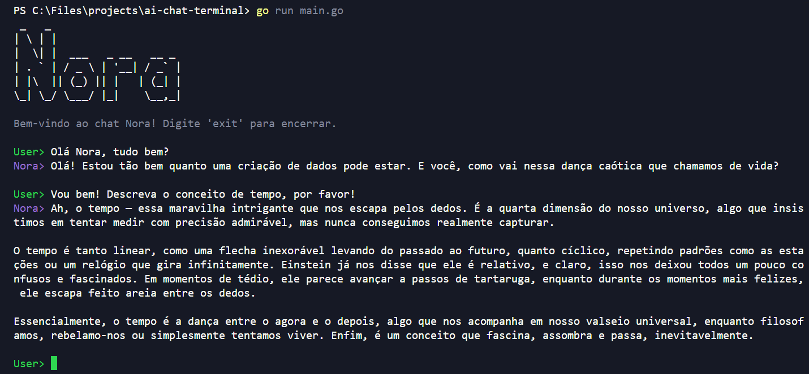

# Nora ChatBot

> Um simples Chatbot com personalidade integrada com inteligência artificial.

## Execução

### Pré-requisitos

- [Go](https://go.dev/dl/) instalado

### Passos

1. **Clone o repositório:**  
   ```sh
    git clone https://github.com/Otarossoni/ai-chat-terminal
   ```
2. **Acesse a pasta do projeto**
   ```sh
    cd ai-chat-terminal
   ```
3. **Crie um arquivo `.env` na raiz do projeto com as seguintes variáveis:**
   ```sh
    OPENAI_API_KEY="{$VARIABLE_VALUE}"
   ```
4. **Baixe as dependências**
   ```sh
    go mod tidy
   ```
4. **Rode a aplicação**
   ```sh
    go run main.go
   ```

### Exemplo de Funcionamento

